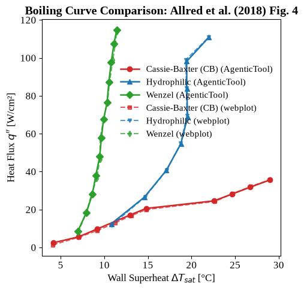
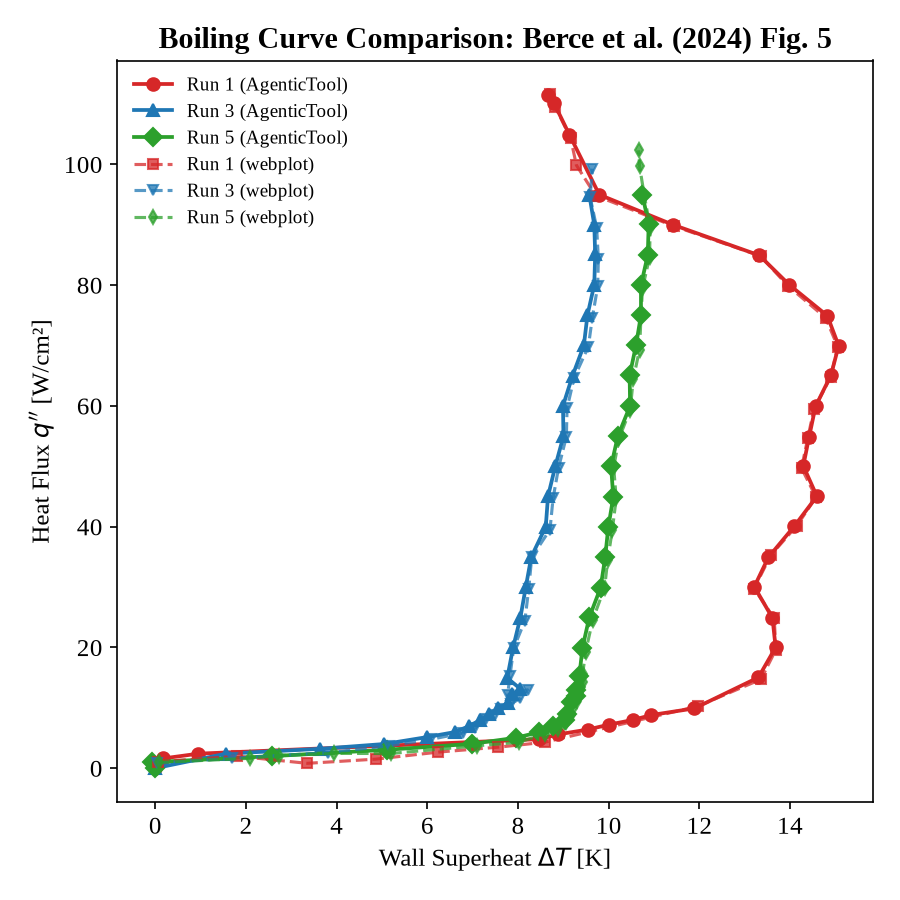

# MHT-DataHub

An automatically-labeled, searchable catalog of **multiphase heat transfer** datasets.
Each entry is grounded in its source paper and carries a normalized numeric operating
envelope plus multi-tier faceted tags derived from it — with every value traceable to
a verbatim quote, its page number(s), and its section(s).

---

## Quick start

```bash
cd mht-datahub
pip install -e .

python -m mhtdb.pipeline backends                 # what's available here
python -m mhtdb.pipeline run papers/*.pdf --build # extract + rebuild dashboard
# then open app/dist/index.html
```

Run everything from the repo root. `pip install -e .` also creates an `mhtdb`
console script, but on Windows it lands in
`%APPDATA%\Python\Python312\Scripts`, which is often not on PATH — so
`python -m mhtdb.pipeline` is the form used throughout this file.

## Adding more papers

Drop the PDFs in `papers/` and run the same command. Everything is incremental
by construction — **nothing already in the catalog is recomputed or reshuffled.**

```bash
python -m mhtdb.pipeline run papers/*.pdf --build
```


## Pipeline stages

```
S0  ingest      PDF -> DocumentModel: normalized text, page index, section index,
                figure crops + captions.        mhtdb/s0_ingest.py
S1  triage      paper type, contains-dataset gate.
S2  conditions  numeric envelope in the paper's own units + evidence quotes.
S3  taxonomy    facets from the controlled vocabulary, or propose_new.
S4  application application target, with evidence. Hallucination hotspot.
S5  normalize   DETERMINISTIC: units -> SI, CoolProp properties, dimensionless
                groups, plausibility gate, binning -> derived tags.
                                                mhtdb/normalize.py
S6  verify      (a) mechanical: every quote must occur in the document;
                (b) optional LLM audit pass for contradictions.
S7  commit      catalog/records/<id>.json, git-tracked.
S8  crops      every figure/table -> its own cropped PDF + PNG, caption
                included.                       mhtdb/figure_crops.py
S9  points      PROMPT-DRIVEN, one figure per paper: a cheap call picks the
                paper's one boiling-curve figure, then an agentic `claude`
                CLI call (tool use enabled) opens it, extracts vector paths
                or traces raster pixels, and resolves axis values — never
                guesses them.                  mhtdb/digitize.py
S10 curves      point tables -> CSV + comparison plot with a CoolProp-backed
                Rohsenow overlay.               mhtdb/curves.py
```


### End-to-end notebook

[`mht_datahub_pipeline.ipynb`](mht_datahub_pipeline.ipynb) runs the whole
pipeline top to bottom against whatever PDFs are in `papers/`: install deps,
pick a model backend (`api` / `claude-code` / `codex` / offline rules),
optionally reset the catalog, S0–S7 ingest and extract each paper into a
catalog record, S8 crop every figure and table, S9 digitize each paper's one
boiling-curve figure, S10 compile the digitized points into a CSV and
comparison plot, build the dashboard, then verify the result and preview it
inline. It's the fastest way to reproduce a full run — or to rerun everything
after adding new papers — without piecing the CLI commands together by hand.

### WebPlotDigitizer cross-check

To sanity-check `digitize` against an independent, human-driven digitization,
two of its outputs were compared against the same figures re-digitized by
hand in [WebPlotDigitizer](https://automeris.io/WebPlotDigitizer/): Allred et
al. (2018) Fig. 4 and Berce et al. (2024) Fig. 5. In both cases the
AgenticTool series and the WebPlotDigitizer series overlay closely across the
full boiling curve, including the transition and film-boiling regions.

| Allred et al. (2018) Fig. 4 | Berce et al. (2024) Fig. 5 |
| --- | --- |
|  |  |

See [`webplot-digitizer_comparison/webplot_comparison.ipynb`](webplot-digitizer_comparison/webplot_comparison.ipynb)
for the comparison code and data behind both plots.


